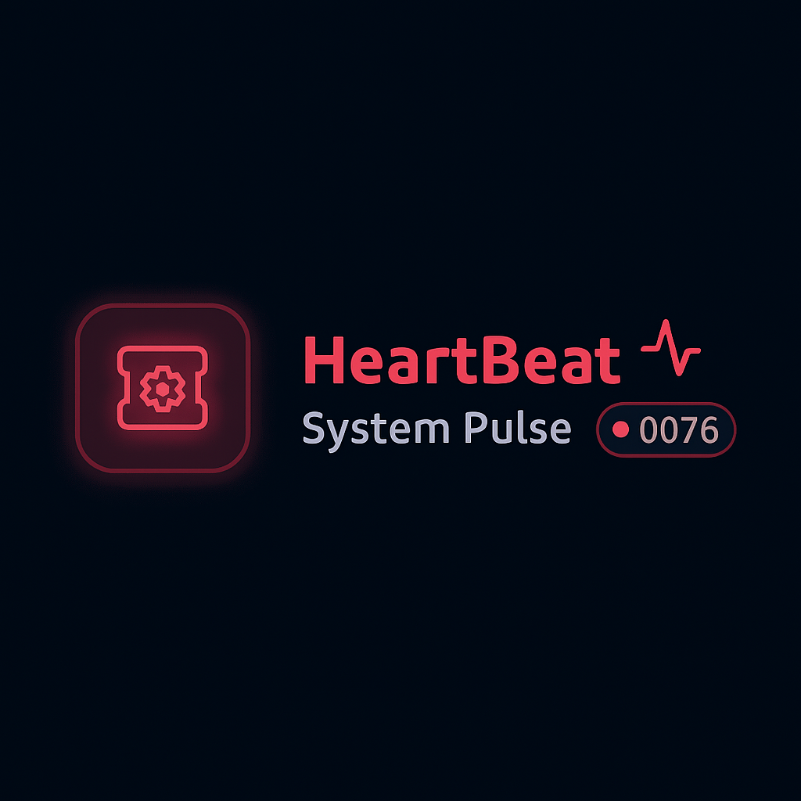

# 💓 Heartbeat Portal

> Monitor all your ECS clusters and services—**across environments, at a glance**.

## 🧠 Why Heartbeat?

As a DevOps engineer, I often found myself facing these recurring problems:

- 💤 **Laziness & inefficiency**: Opening each ECS cluster individually on the AWS Console just to check running tasks.
- 🔁 **Misconfigurations**: Sometimes due to incorrect deployment or migration, services ran more tasks than required, costing more and adding chaos.
- 📉 **Poor observability**: Even with tools like Grafana or SigNoz, I needed to manually select the cluster and service from dropdowns—**again and again**—just to get basic information.

> In short: **Too many clicks, not enough visibility.**

## 🚀 The Solution: Heartbeat Portal

I envisioned a unified view—where I could:

✅ See the real-time running task count for **all services in all ECS clusters**  
✅ Monitor configuration drift or unexpected behavior (like over-provisioning)  
✅ Avoid jumping between AWS Console, Grafana, or dashboards  

And so, **Heartbeat Portal** was born.

---

### ⚡ Plug & Play, Minimal Cost Monitoring

All of this at **unnoticeable AWS cost**.  
Just plug and play — configure your AWS profiles and **see the magic** ✨

---

## 🛠️ Tech Stack

I learned backend, frontend, and microservices in college, so I leveraged that knowledge and curiosity to build this portal.

- **Frontend**: [Next.js](https://nextjs.org/) + React
- **Backend**: [FastAPI](https://fastapi.tiangolo.com/)
- **Deployment**: Containerized for portability

---

## ✨ Features

- 🔍 View **running ECS tasks** across all clusters & services
- 🌍 Supports **multi-environment visibility**
- 💡 Detect **misconfigurations** or **auto-scaling drifts**
- 🧩 Plug & play architecture (can be extended to Lambda or other services in future)

---

🔮 Future Possibilities
Heartbeat is designed to be extensible. In future iterations, we plan to extend support beyond ECS to other AWS services like Lambda, SQS, RDS, and Auto Scaling Groups.

The vision is to evolve Heartbeat into a unified, low-cost monitoring dashboard for all critical AWS workloads.

---

## 📂 Project Structure

This is a **monorepo** containing:
<pre>
/ECSBoard-portal 
├── backend/         # FastAPI-based API to fetch ECS data 
├── frontend/        # Next.js frontend for displaying ECS status 
├── README.md        # Main project README (you're here!) 
└── ...              # Other supporting files/configs
</pre>

Each subfolder has its own README with setup instructions.

- 👉 [Backend README](./backend/readme.md)
- 👉 [Frontend README](./fronend/readme.md)

---

## 💭 Inspiration

The idea was simple: **make ECS monitoring simple enough to fit in one screen.**  
Driven by laziness (yes, really), curiosity, and the day-to-day pain of scattered observability—Heartbeat is my answer to centralized, practical, and usable ECS insight.

---

## 👨‍💻 Developer Notes

This is a work-in-progress project, but stable and ready to use for most ECS use cases.  
I'm also planning to support Lambda and ASG in the future for even broader DevOps observability.

---

## 🛠️ Setup (Summary)

- Clone the repo
- Follow individual `README.md` in `backend/` and `portal/`
- Run both projects (use Docker, or separately in terminals)

---

## 🙌 Contribute / Feedback

Have ideas or want to contribute?  
Open an issue, drop a PR, or just ⭐ the repo if you find it useful.

---

## 🙏 Acknowledgements

A big thank you to my manager and lead, **Nikhil Kulkarni**, for the unwavering support, valuable feedback, and encouragement throughout this journey.
Your guidance and “cool manager” attitude made building Heartbeat Portal possible. This project wouldn’t have been the same without your help!
Thank you for believing in me and enabling me to bring this idea to life.  

---

## 🧑‍🚀 Author

**Yogesh Patil** – *DevOps Engineer & builder at heart*  
Follow me on [LinkedIn](https://www.linkedin.com/in/yogeshp-dev) for more interesting stuff.

---

## 📃 License

This project is licensed under the MIT License.
